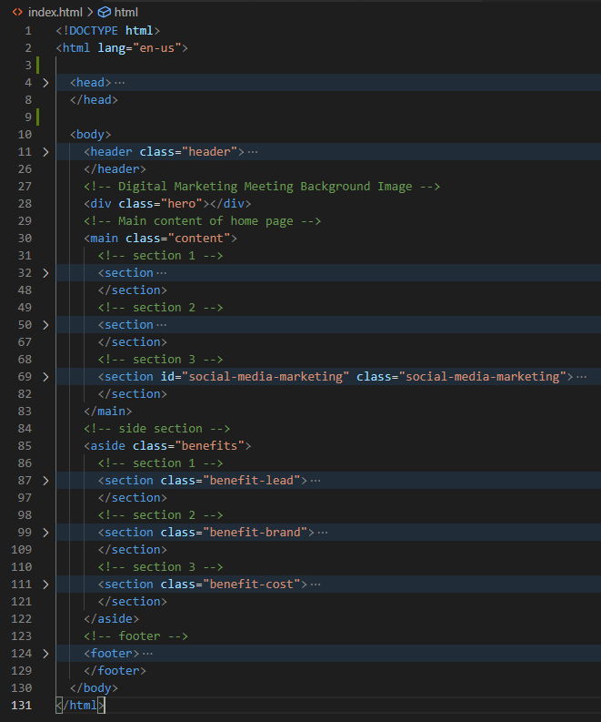

# 01 HTML, CSS, and Git: Code Refactor

The webpage codebase has been refactored to meet accessibility standards along with functional improvements. 

https://marcuslau0903.github.io/homework-week-1/

# <h2>Adjustments:<h2>
- [x] Refactored the HTML page body with semantic HTML elements which follows by a logical structure of a header,navigations, main, aside and a footer.

- [x] Given a concise and descriptive title for the webpage to improve search optimisation.

- [x] Headers falls in sequential order from H1-H3.

- [x] alt attributes are added into image elements. 

- [x] Comments are added to provide explanatory information of the source code which helps understanding and maintenances.

- [x] In the stylesheet, classes with common properties are grouped together in order to avoid repetition.

- [x] The navigation element has been fixed by assigning an **id="seach-engine-optimization"** to section 1 of the main.  

